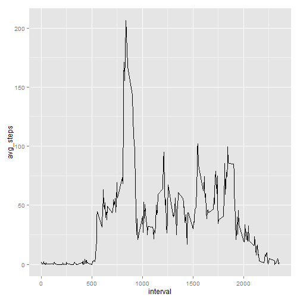

First I will set the working directory, loading data, loding the package plyr for ddply


```r
setwd("C:/Users/Filip/coursera/data science/Reproducible Research/RepData_PeerAssessment1")
activity <- read.csv("./activity.csv", header=TRUE)
library(plyr)
```

# What is mean total number of steps taken per day?
first counting the nbr of steps each day


```r
nbr_steps_date <- ddply(activity, ~date, summarize, nbr_steps=sum(steps), mean_steps=mean(steps), med_steps=median(steps))
with(nbr_steps_date,plot( date, nbr_steps, type="l"))
```

 

Now lets calc the mean of nbr of steps per day


```r
mean_steps <- mean(nbr_steps_date$nbr_steps, na.rm=TRUE)
mean_steps
```

```
## [1] 10766.19
```

and the median of nbr of steps per day


```r
med_steps <- median(nbr_steps_date$nbr_steps, na.rm=TRUE)
med_steps
```

```
## [1] 10765
```

# What is the average daily activity pattern?

first the average. be aware of the missing values within steps


```r
avg_steps_int <- ddply(activity, ~interval, summarize, avg_steps=mean(steps, na.rm=TRUE), nbr_steps=sum(steps, na.rm=TRUE))
```

Now, lets take a library ggplot for a nice time series plot and plot the average steps per intervall for all dates 


```r
library(ggplot2)
p <- ggplot(avg_steps_int, aes(x=interval, y=avg_steps))
p + geom_line()
```

 

# Imputing missing values

first counting the total nbr of rows with missing values by calculating the nbr of rows - the sumber of complete cases


```r
nrow(activity) - sum(complete.cases(activity))
```

```
## [1] 2304
```

use avg nbr of steps in nbr_steps_int in order to impute the missings steps. first step merge the two table using merge by interval


```r
act_imp <- merge(activity, avg_steps_int[,c("interval","avg_steps")], by.x="interval", all=TRUE)
imp_steps <- apply(act_imp, 1,function(x) {ifelse(is.na(x["steps"]),round(as.numeric(x["avg_steps"])),as.numeric(x["steps"]))})
activity$imp_steps <- imp_steps
```

here another imputation which look more promissing after all. average steps per date nstead of average steps per intervall


```r
avg_steps_date <- ddply(activity, ~date, summarize, freq=length(steps), nbr_steps=sum(steps, na.rm=TRUE))
#head(avg_steps_date)
avg_steps_date$avg_steps <- ifelse(avg_steps_date$nbr_steps >0, avg_steps_date$nbr_steps / avg_steps_date$freq, 0)
#head(avg_steps_date)
act_imp_date <- merge(activity, avg_steps_date[,c("date","avg_steps")], by.x="date", all=TRUE)
#head(act_imp_date)
imp_steps_date <- apply(act_imp_date, 1,function(x) {ifelse(is.na(x["steps"]),round(as.numeric(x["avg_steps"])),as.numeric(x["steps"]))})
#head(imp_steps_date)
activity$imp_steps_date <- imp_steps_date
```


### 4. total number of steps taken each day and...


```r
nbr_imp_steps_date <- ddply(activity, ~date, summarize, nbr_imp_steps=sum(imp_steps))
```

and here with the other imputated variable


```r
nbr_imp_steps_date_date <- ddply(activity, ~date, summarize, nbr_imp_steps_date=sum(imp_steps_date))
```


### 4. Calculate and report the mean and median total number of steps taken per day.

first mean


```r
mean_imp_steps <- mean(nbr_imp_steps_date$nbr_imp_steps, na.rm=TRUE)
mean_imp_steps
```

```
## [1] 10765.64
```

and the median of nbr of steps per day


```r
med_imp_steps <- median(nbr_imp_steps_date$nbr_imp_steps, na.rm=TRUE)
med_imp_steps
```

```
## [1] 10346
```

### 4. Do these values differ from the estimates from the first part of the assignment? 


```r
mean_steps - mean_imp_steps
```

```
## [1] 0.549335
```

```r
med_steps - med_imp_steps
```

```
## [1] 419
```

The mean of steps dont differs from the mean of imputed steps but the median does differ.

### 4. Make a histogram of the total number of steps taken each day and...

What is the impact of imputing missing data on the estimates of the total daily number of steps?


```r
with(nbr_imp_steps_date,plot( date, nbr_imp_steps, type="l"))
```

 

well the total nbr of steps per day looks pretty much the same as the picture of the timeries above wich is for sure not right!

here with the other imputation where the average per date was used for imputation


```r
with(nbr_imp_steps_date_date,plot( date, nbr_imp_steps_date, type="l"))
```

 

looks much better!!!

her another check of the imputed new variable imP_steps... comparison with the timeseries plot!


```r
avg_imp_steps_int <- ddply(activity, ~interval, summarize, avg_steps=mean(imp_steps))
p <- ggplot(avg_imp_steps_int, aes(x=interval, y=avg_steps))
p + geom_line()
```

 

well, doesnt look the same at all :-( but lets have a look at the other imp variable


```r
avg_imp_steps_date_int <- ddply(activity, ~interval, summarize, avg_steps=mean(imp_steps_date))
p <- ggplot(avg_imp_steps_date_int, aes(x=interval, y=avg_steps))
p + geom_line()
```

 

much better!!!

# Are there differences in activity patterns between weekdays and weekends?

first i construct the weekend flag using weekdays.
second I aggregate the the average steps

* original steps
* imputed steps

by the just constructed weekend flag w_flag and interval variable on the activity data


```r
activity$w_flag <- ifelse(weekdays(strptime(gsub("-","",as.character(activity$date)),"%Y%m%d")) %in% c("Samstag", "Sonntag"), "we", "wd")
avg_steps_w_flag_int <- ddply(activity, ~w_flag*interval, summarize, avg_steps=mean(steps, na.rm=TRUE), nbr_steps=sum(steps, na.rm=TRUE))
avg_imp_steps_w_flag_int <- ddply(activity, ~w_flag*interval, summarize, avg_steps=mean(imp_steps))
```

Now lets print the result with the original steps first using ggplot


```r
p <- ggplot(avg_steps_w_flag_int, aes(x=interval, y=avg_steps)) + geom_line()
p + facet_grid(. ~ w_flag)
```

 

hm... what the hell are they doing at the morning. are they going to work? hm... where ist the second beat? I dont get it!

And here with the step variable where missing values are imputed by the mean of the intervall at all


```r
p <- ggplot(avg_imp_steps_w_flag_int, aes(x=interval, y=avg_steps)) + geom_line()
p + facet_grid(. ~ w_flag)
```

 

well looks not very differnt. I guess it is because of my imputation

lets try the same with the other imputation


```r
avg_imp_steps_date_w_flag_int <- ddply(activity, ~w_flag*interval, summarize, avg_steps=mean(imp_steps_date))
p <- ggplot(avg_imp_steps_date_w_flag_int, aes(x=interval, y=avg_steps)) + geom_line()
p + facet_grid(. ~ w_flag)
```

 

well doesnt explain the first beat in week days but at least the data looks pretty similar to the picture two above
